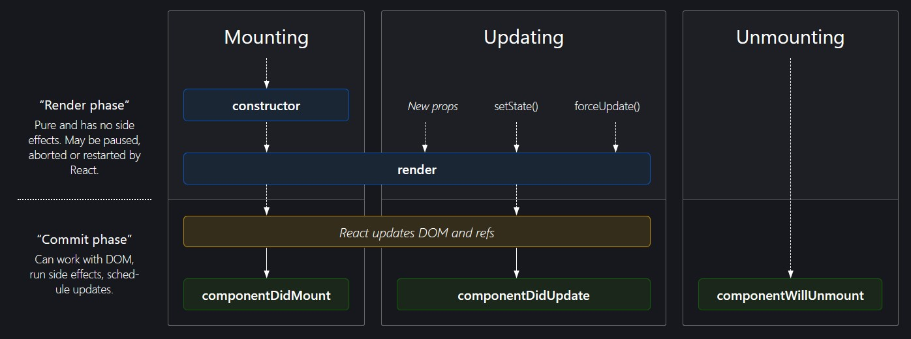

# React Cheatsheet

## Table Of Contents

- [React Cheatsheet](#react-cheatsheet)
  - [Table Of Contents](#table-of-contents)
  - [Design Patterns](#design-patterns)
  - [Component Lifecycle](#component-lifecycle)
  - [Precompile](#precompile)
  - [JSX](#jsx)

## Design Patterns

A common React programming pattern is to use a parent
stateful component to manage state and define state updating methods. Then, it will render stateless child components.
One or more of those child components will be
responsible for updating the parent state (via methods
passed as props). One or more of those child
components will be responsible for displaying that state.

Here is a snippet code that Menu.js is a stateless component and will update the state of its parent component.

```javascript
class App extends React.Component {
  constructor(props) {
    super(props);
    this.chooseVideo = this.chooseVideo.bind(this);
  }

  chooseVideo(newVideo) {
    this.setState({
      // Change something
    });
  }

  render() {
    return (
      <div>
        <h1>Video Player</h1>
        <Menu chooseVideo={this.chooseVideo} />
      </div>
    );
  }
}
```

```javascript
class Menu extends React.Component {
  constructor(props) {
    super(props);
    this.handleClick = this.handleClick.bind(this);
  }
  
  handleClick(e) {
    // The e is an event object
    this.props.chooseVideo(e.target.value);
  }

  render() {
    return (
      <form onClick={this.handleClick}>
      </form>
    );
  }
}
```

## Component Lifecycle



## Precompile

**Some tools for a React app**

1- Precompile the code with JSX format: `npx babel <src> --out-dir <out> --presets react-app/prod`

2- Good dependencies:
    - babel-cli
    - babel-runtime
    - babel-preset-react-app

3- Webpack creates a bundle. [Read more][1]

```python
# This python code will pre-compile the JavaScript files including JSX format
# Then uses webpack to create a bundle file
# ez pz
import os


def pre_compile():
    os.system('npx babel <src> --out-dir <out> --presets react-app/prod')


def bundle():
    os.system('npx webpack')


if __name__ == '__main__':
    print('Start pre compiling JavaScript files')
    pre_compile()
    print('Start bundling the app')
    bundle()
    print('Done')
```

## JSX

- **Conditional:** `&&` is commonly used to render an element based on a boolean condition.
```jsx
{condition && <Element />}
{condition && <p>A paragraph</p>}
```

[1]: https://webpack.js.org/guides/getting-started/